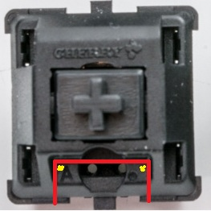

### Модификация переключателя Cherry MX для RGB светодиода.
-----------------------------------------------------------
Снять крышку.

Высверлить углы (жёлтая точка).

Вырезать маленьким ножом для бумаге сначала снаружи, потом перерезав перемычку вы резать через просверленные отверстия(по оранжевой линии).

